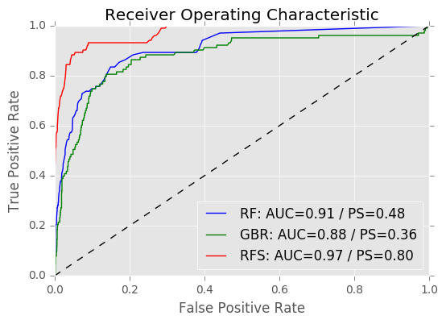
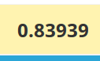
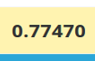

Kaggle challenge : [Facebook Recruiting IV: Human or Robot?](https://www.kaggle.com/c/facebook-recruiting-iv-human-or-bot)

### Installation

- Setup environment

```
virtualenv venv
source venv/bin/activate
pip install -r requirements
```

- Jupyter python 2 kernel (if necessary)

```
python2 -m ipykernel install --user
```

- Download the data

```
mkdir data
```

Download the zip files into this folder.

- Run the jupyter notebook

```
jupyter notebook
```

### Main goal

Detect bots and minimize as much as possible the "False Positive" : we do not want to ban real bidders.

### Problematics

 - Imbalanced data :

| bidder      | count |
|-------------|-------|
| Non Bot (0) | 1881  |
|     Bot (1) | 103   |

 - Different types of bot flagging : this part has not been treated, but could be a key part to increase the precision rate.

### Approach

#### Regression

The first approach is to run a regression algorithm on bidders features computed with the bid database.

No informations on the bidder itself were usable.

The first intuition is to compute the number of bid of each bidder, the number of auctions he participated to and the number of unique values of each feature : ips, url, merchandise, device.

These informations could also be averaged by auction.

The times of the bids is also very important and have been split in different metrics :
 - The standard deviation of the time to detect wide spread bids of time boxed bids
 - The time range
 - The min, max and standard deviation of the elapsed times between bids
 - The "ubiquity"

The ubiquity is the difference between the number of bids and the number of distinct time. This number should be very close to 0.

Two algorithms were benchmarked : the random forest and the gradient boosting which are known to have good performances with little overfitting.
These two algorithms could have been used as classifier but were used as regressor to observe the evolution of performances over the threshold.

The kaggle performance is based on the overall prediction, but it is important to keep in mind that false positives imply users banning.

#### Grayscale

The second approach (not implemented) would be to observe for each bidder a grayscale of bids : the row would be the minutes of an hour (60 rows) and the columns the hour of a day (24 columns). A bot would have a grayscale with very less "noise".

### Results

Results are visible/reproducible using `prediction.ipnb`

#### ROC curves

We want to have a good precision but also a good global prediction rate. The ROC curve will help us to choose the best threshold.



In this picture there are 3 ROC curves : RF, for the random forest, GBR, for the gradient boosting and RFS for the random forest trained on balanced data. The AUC (area under the curve) is the good approximation of the global performance of the algorithm. To optimize the precision (without reducing the global performance too much, we want the curve to be very high as soon as possible.

#### Confusion matrix

Based on the ROC curve we can choose the threshold that minimize the false positive rate and stil have good true negative rate. For instance, for the random forest, `0.02` gives this confusion matrix :

|         | prediction |         |         |
|---------|------------|---------|---------|
| reality |            | not bot | bot     |
|         | not bot    |  0.770  |  0.229  |
|         | bot        |  0.106  | *0.893* |

#### Feature importance

The random forest gives a ranking of the features. The number of bids per auction is the most relevant and the time based features too.

It could be tricky because of the stats based flagging that surely use this metrics to detect bots.

|    feature     |  score   |
|----------------|----------|
| mean_nb_bid_id | 0.209351 |
| time_std       | 0.086623 |
| mean_nb_ip     | 0.084642 |
| time_range     | 0.082040 |
| ...                       |

#### SMOTE algorithm

The SMOTE algorithm will densify classes with low population (in our case the bots). The algorithm is trained on with this new simulated population.

The ROC curve shows very goods results, but this fake densification impact the overall results on kaggle testset :

Score with the raw trainset :



Score with the trainset densify with SMOTE algorithm :



The SMOTE strategy of balancing data is not working mostly because of the feature we used, but it could be useful to try other strategies too (undersampling for instance).

#### Annexe

### What didn't work

 - feature selection : top 5 features perform less than all the features
 - sample weights : weights on the positive population doesn't help

### Didn't try

 - Find the algorithm used to flag bots (a graph in `exploration.ipnb` has been made)
 - Time related to ips : a bot would be with multiple ips/bidder_id at the same times, thus correlations between time series could be helpful.

#### Unit tests

```
nosetests --rednose --force-color tests/
```
